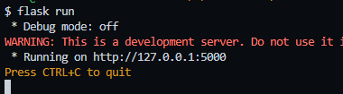
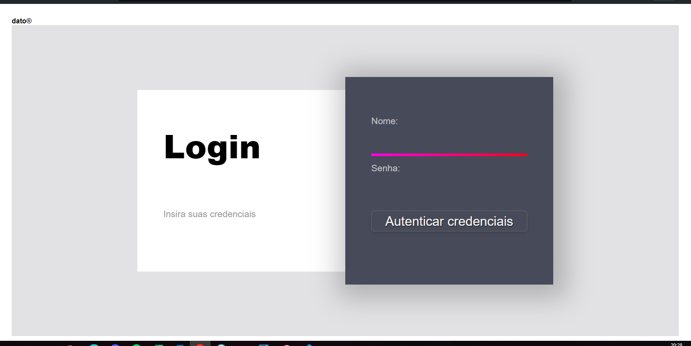

# ***Tela de Login***

Projeto simples com um layout base de uma tela de login

para visualizar e conseguir aplicar ajuste, estamos usando o framework FLASK com servidor local com


intruções: 
## intalar dependencia:
```bash
pip install flask
```
## execultar servidor flask local

```bash
flask run
```
resultado 



